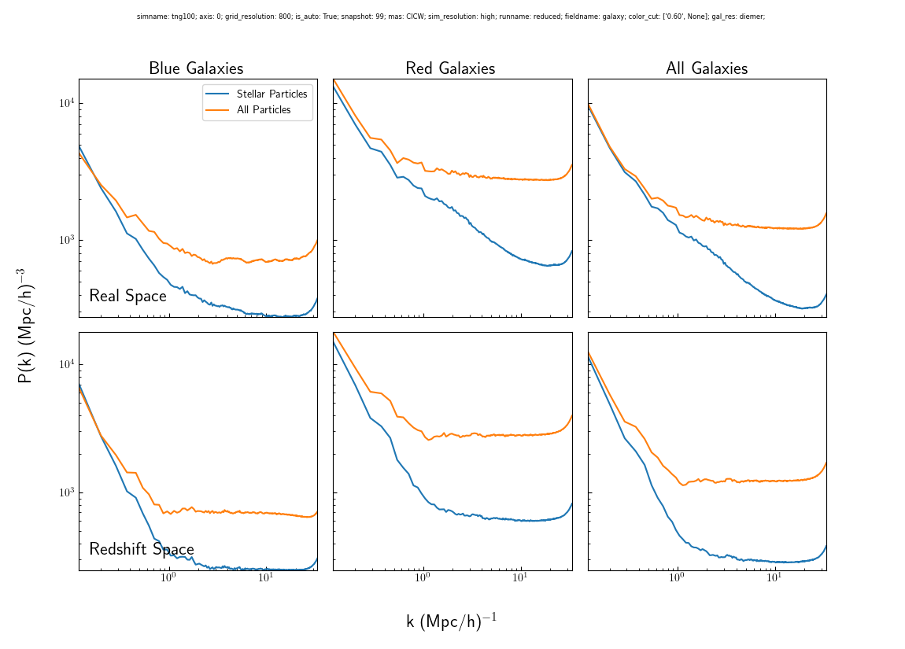

# Intro

# Methods

## IllustrisTNG

Start off with a discussion about the sample

Galaxy color cut, only uses stellar mass

## Hydrogen Phase Models

Discuss the differences between the models, include this slices figure:

Fix the figure by making the hisubhalo distribution into a scatter plot (show example). Remove Galaxy + Gas panels, I think it would look too small otherwise. Add colorbar label. Rearrange so that space is going along the rows and the distribution along the columns.

## Power Spectrum

Describe how the power spectra are calculated, explain what redshift distortions are and how they affect the power spectrum. Here can include the second part of the slice panel.

# Results

HI Auto power spectrum, Galaxy Auto Power spectrum, HI-galaxy cross-power

## HI Auto Power Spectrum

Discuss the impact of using different HI distributions on the power spectrum with below figure. Why hisubhalo doesn't experience nearly as strong redshift-space distortions. Small impact of different models within D18. 1-halo vs 2-halo term, separation of hisubhalo and hiptl plots.

Should this be included? Shows redshift space distortions...

## Galaxy Auto Power Spectrum
Expected differences in clustering of optical samples. Differences in how redshift-space distortions manifest.

This one?

Or this one?

Effect of using only stellar mass:

## HI-Galaxy Cross

The following figure shows how different colors affect the HI-galaxy cross-power at different redshifts in real-space:

Redshift space distortions

Redshift evolution

