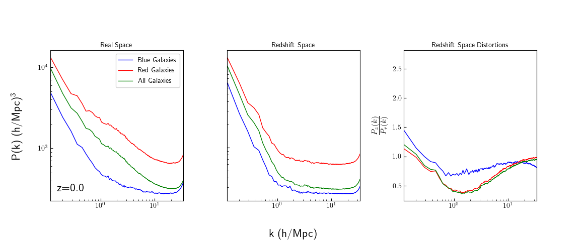
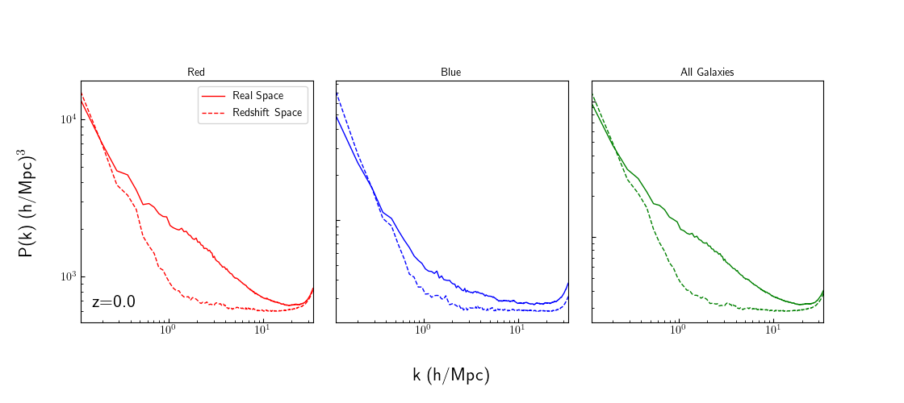
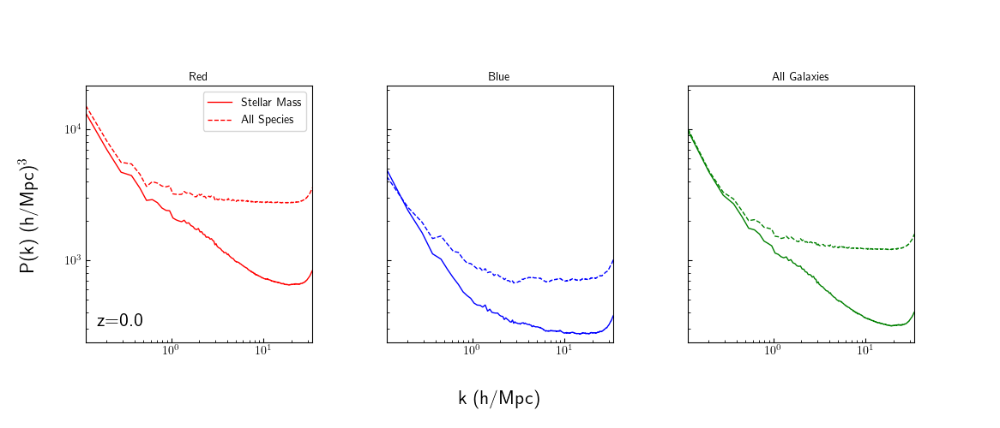
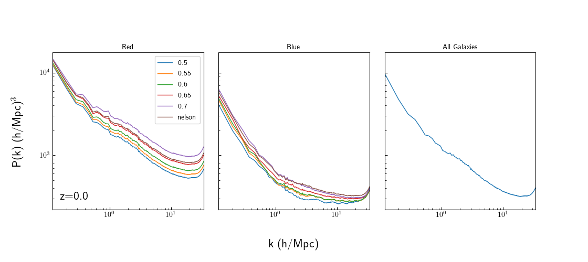
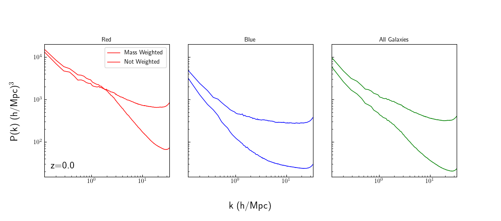
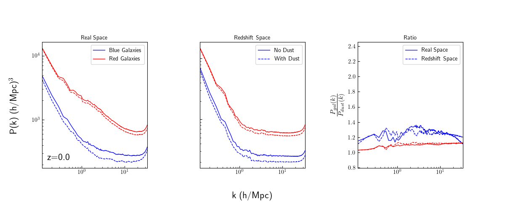
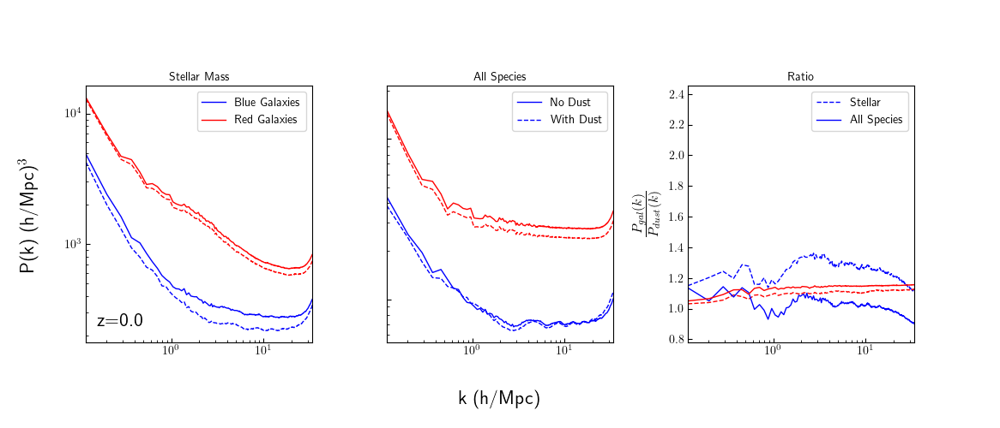

# Galaxy Auto Power Spectrum

This shows plots comparing various auto power spectra of the galaxies. Does so in real and redshift space, and calculates the redshift space distortions for each. The plots below are for TNG100-1 at z=0, using a grid resolution of 800^3. They test dust sensitivity for various parameters, the effect of including all particle species vs just stellar mass, mass assignment scheme, color cuts, and more upcoming.

## To Do:
* Test the effect of different resolution limits (observational compared to the theoretical cut due to poorly resolved subhalos)

# Redshift Space Distortions

This plot compares the clustering of different galactic populations within real and redshift space.

This plot basically recontextualizes what is indicated in the last panel of the above plot, but in a more easy to understand way.

## To Do:

# Stellar Mass vs All Species

This plot shows how using just stellar mass or including all particle species.

## To Do:

# Color Cuts

# Mass Assignment Scheme

Shows how using unweighted or weighted MAS affects the power spectrum.

# To Do:
* Change the linestyles of the not weighted to dashed line.

# Dust sensitivity

## Space

## Particle Species

## Color Cut

