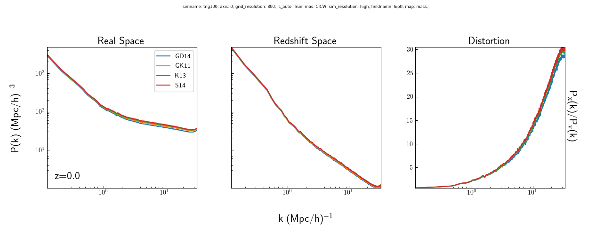
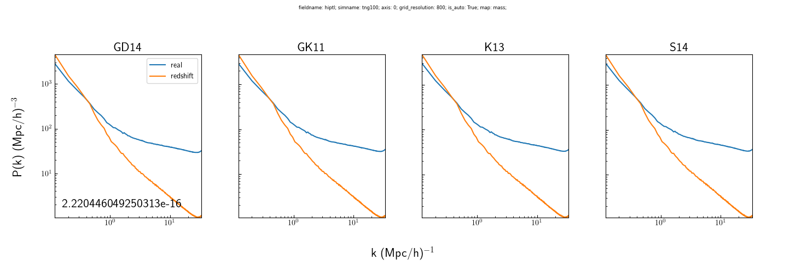
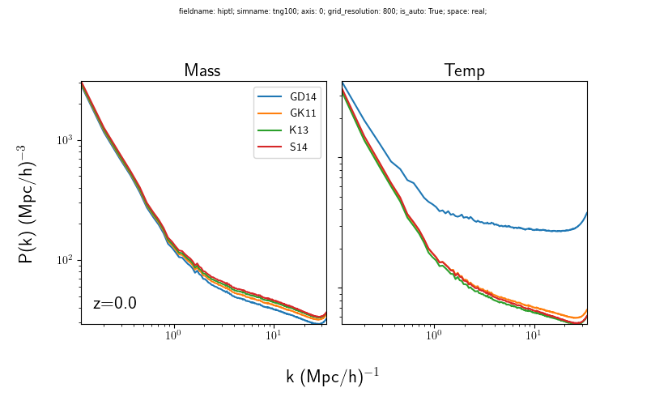
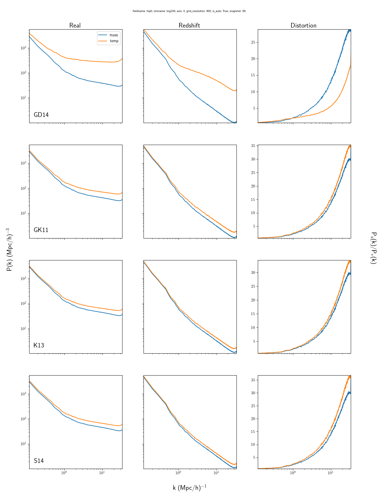

# D18-Particle Auto Power Spectra

Shows auto power spectra of the HI calculated from D18 prescriptions, using the positions from the particle catalog.

### To Do
- Adjust xlim past nyquist frequency

# Redshift Evolution

Shows the redshift evolution of the D18-Particle HI distribution in real and redshift space. There is very little difference among the different models in both spaces. Interestingly the distortion panel looks much different than it did in subhalo-based power spectra from D18-Subhalo and galaxies. This is probably due collapsing all of the mass to the center of galaxies, which will lose information on the smallest scales.

Further the magnitude of the distortion is also much greater. I also think this is characteristic of a particle-based distribution since you should have much faster velocities than the galaxy as a whole.

### Cosmetic Issues
- mathrm the x,v

# Velocity Space Distortions

Shows the effect of velocity distortions on the power spectra. Clearly displays the fingers-of-god. Interestingly, I cannot see almost any Kaiser Effect. Not sure if this is because of how the graph is displayed, also seems reasonable that using velocities for individual particles breaks up the "streaming together" reason for the Kaiser Effect. Otherwise similar conclusions to above.

### Cosmetic Issues
- Fix the row label
- Legend: 'Real Space', 'Redshift Space'
- Change colors to be blue for real, red for redshift

### Further Investigation
- Why the kaiser effect is so much smaller

# Mass vs Temperature Maps

Shows the variation in the models based on whether or not the power spectra was calculating using the HI mass or the predicted temperature. There is little variation within the models, except for GD14 in the temperature panel. I have no idea why this would be the case.

### Cosmetics
- The y-axes don't look as though they match, which might be why the two panels look more similar than they should.
- Add the equation to the figure

### Further Investigation
- Plot would be better as mapR_spaceC_model.png
- Why is GD14 so different? Is there a bug?

Shows the difference between the two maps within each space and model. As seen in the above plot, there seems to be only a small difference for most of the plots. GD14 is the only one with any significant difference.

Most of the temperature plots are slightly higher than their mass equivalents. At this point, I'm not completely sure why.

### Cosmetics
- Change the legend
- mathrm x/v

