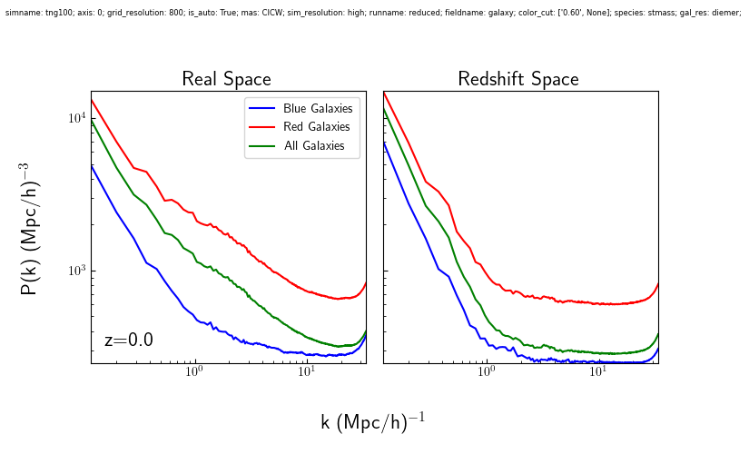
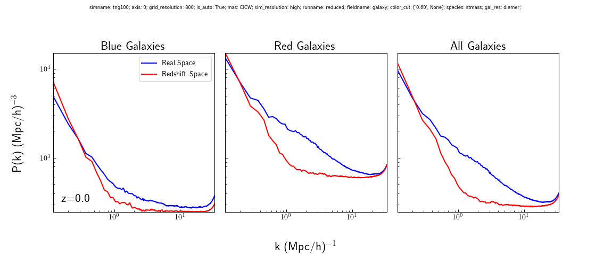
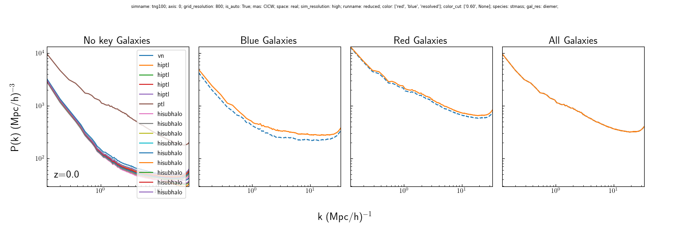

# Galaxy Auto Power Spectrum

This shows plots comparing various auto power spectra of the galaxies. Does so in real and redshift space, and calculates the redshift space distortions for each. The plots below are for TNG100-1 at z=0, using a grid resolution of 800^3. They test dust sensitivity for various parameters, the effect of including all particle species vs just stellar mass, mass assignment scheme, color cuts, and more upcoming.

### To Do
- For all pk plots, push the x-axis limit a bit further than the nyquist frequency.
- Add redshiftR_colorC_space to more easily see velocity distortions

# Evolution with Redshift

This shows how the real and redshift-space power spectra of the blue and red galaxies' auto power spectrum at different redshifts. Red galaxies cluster more strongly than blue galaxies on all scales, as one would expect since they occupy higher density environments. This is true in both real and redshift space. Looking at the last column, the distortions show the strength of the Kaiser Effect at low k when the distortions are less than 1. The Kaiser Effect is related to how groups of galaxies move together, such that they appear closer in velocity space. The fingers-of-god effect is at high k, which occurs from the apparent stretching of matter along the line of sight due to matter infalling.

I am unsure as to why blue galaxies would experience a stronger Kaiser Effect, but it makes sense that red galaxies experience a stronger fingers-of-god effect since there should be a larger range of velocities for virialized matter in the larger red galaxies. I am also curious as to why the k at which the distortions from the fingers-of-god effect are the strongest would be around k ~ 1 h/Mpc.

### Further Investigation
- Why do blue galaxies experience a stronger Kaiser Effect?
- Why do the distortions peak around k ~ 1 h/Mpc?

# Dust Sensitivity

## 

Shows how sensitive the power spectra for the galaxies are to excluding dust from the calculation at different redshifts. Including dust tends to make galaxies appear more red than they actually are, which is why both the red and blue power spectra see less clustering. The red population is infected by previously classified 'blue' galaxies, which would be its most isolated subgroup, bringing the clustering of the whole population down. Whereas, the blue populations become more blue than before by removing more of their fringe cases.

In both cases, it is evident that dust has a small effect on the power spectrum as a whole. The behavior of the power spectrum does not change due to dust. A small vertical translation happens in both red and blue galaxies, which I estimate to only reduce their power by less than a factor of 2 at all scales, and even less than that at most k.

After I run this with different lines of sight, will show whether there's any dependency on the relationship between galaxy and galaxy-dust.

### Cosmetics
- capitalize the row label

### Further Investigation:
- confirm the magnitude of the vertical translation

# Particle Species

This plot shows how excluding gas, dark matter and black holes affect the clustering of the red and blue galaxies in real-space for both cases with and without a dust prescription. If we use all mass, we see much stronger clustering on smaller scales with negligible differences on larger scales. My initial guess is that there might be a lot of smaller dark matter dominated halos as satellites that add power at high k as compared to just stellar mass.

In terms of the shapes, the total mass for blue galaxies doesn't make a ton of sense. At high k, it has an oscillating shape and it's not clear why that is the case. Waves like this arise from delta functions in the position space, so maybe there is some characteristic separation that contributes a bunch of mass at these scales? Unsure if it's worth looking into.

### Further Investigation
- Why do the blue galaxies' all mass have the strange oscillations?
- Plot the power spectrum of different particle species to help understand how each contributes to the overall clustering.
- Test hypothesis about dark matter dominated halos contributing to the smaller scales

# Color Cut

Shows the sensitivity of the clustering to the color cut used. Red is extremely insensitive in its behavior, only resulting in vertical translations that are likely due to the changing sample size. Blue galaxies get small changes in behavior at the largest k values, but mostly see similar types of changes.

### Further Investigation
- Add histograms to this section
- In the blue galaxies, at the smaller g-r thresholds, the oscillations manifest again
- Galaxy_dust the fiducial cut is not straddled by outside thresholds

# Mass Assignment Scheme

This plot compares the effect of using a mass-weighted assignment scheme as compared to a number density-weighted assignment scheme. I did this plot because Papastergis did not weight the clustering based on mass (as far as I can tell), so it would be important to understand the difference between the two.

Blue galaxies with CIC have a steeper depencency on k. My reasoning is that we reach scales within clusters, CICW will downweight all of the pairs calculated because the central is expected to be dominate in terms of mass. CIC will however count them all equally, which is why it'll have a steeper k-dependence. I should note though that these would be relationships between blue centrals and blue satellites, which might not be common enough that you would expect this to be the case, but that might explain why red galaxies have a steeper k-dependence at these scales since those should be more common.

Red galaxies have a much stranger shape when using CIC. On large distances, red looks about the same using either number or mass density, and then transitions around k~2 h/Mpc, corresponding to d ~ 3 Mpc/h or about the size of the Local Group. I make sense of this in this way: the same locations where red galaxies contribute a lot of large-scale power in the mass-weighted scheme will also be where clusters of galaxies lie. This means that the cluster of red galaxies "replaces" the contribution of the massive central. Within clusters, the same reasoning outlined in the blue galaxies paragraph should apply.

### Further Investigation
- Does Papastergis13 explain why they chose to weight it this way?
- This would be very sensitive to the threshold used to define a halo, right?