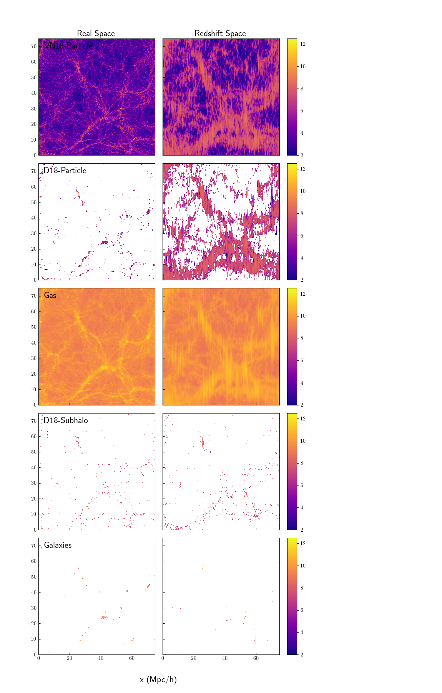
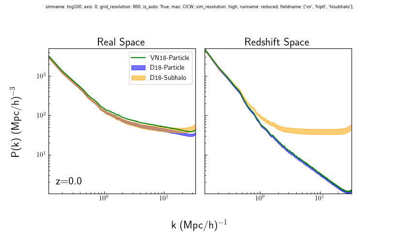
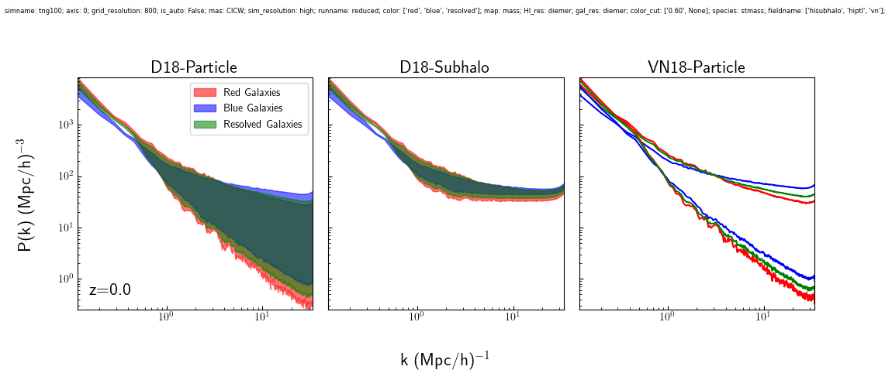
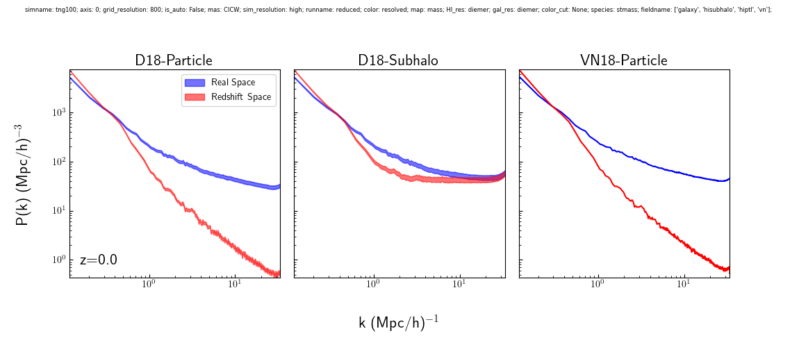

# Intro

# Methods

## IllustrisTNG

Start off with a discussion about the sample

## Hydrogen Phase Models

Discuss the differences between the models, include this slices figure:

Fix the figure by making the hisubhalo distribution into a scatter plot (show example). Remove Galaxy + Gas panels, I think it would look too small otherwise. Add colorbar label. Rearrange so that space is going along the rows and the distribution along the columns.

- I'd like to discuss how the differences manifest in the auto power spectrum, but didn't want to put that before talking about how the power spectrum are calculated and what redshift space distortions are in the next section.

<!--  -->

- Also I'd like to use the slices figure to display RSD, could separate the figure into two parts and put the redshift space panels in the following section. If we move the power spectrum section to the start could leave these together.

- Discuss the effect of models on the power spectra - again, move power spectrum section?

## Power Spectrum

Describe how the power spectra are calculated, explain what redshift distortions are and how they affect the power spectrum. Here can include the second part of the slice panel.

# Results

First describe how different optical samples affect the HI-galaxy power spectrum, then the effect of redshift space distortions.

## Optical Sample Bias

Titled it this way instead of "HI-Galaxy Cross-Power" because I wanted to include the galaxy auto power spectra in this section too. The following figure shows how different colors affect the HI-galaxy cross-power at different redshifts in real-space:

Is expected, red galaxies are more strongly clustered but HI and blue galaxies are expected to occupy the same halos. The clustering behavior of red/blue galaxies is seen here:

Should remove the redshift space panel in the above figure, since that discussion is saved for the next section.

## Redshift Space Distortion

