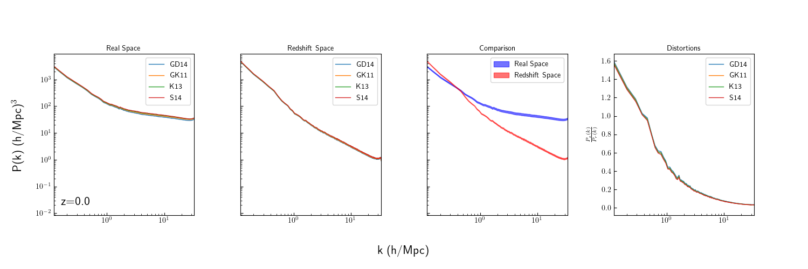
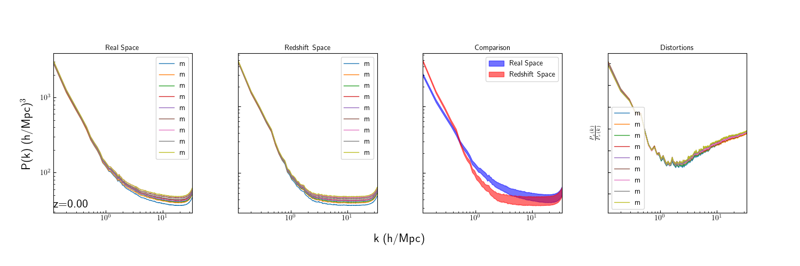
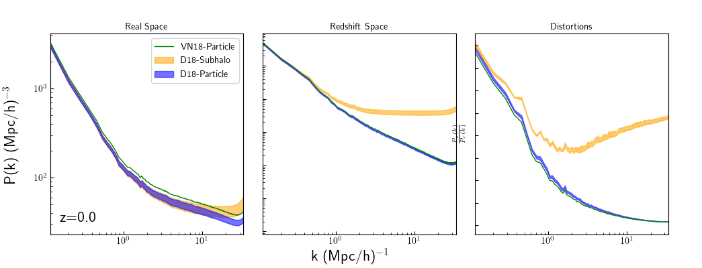

# Auto Power Spectrum for HI

This shows plots comparing various auto power spectra of the HI distributions used. Does so in real and redshift space, and calculates the redshift space distortions for each. The plots below are for TNG100-1 at z=0, using a grid resolution of 800^3

## To Do
* The nyquist frequency doesn't quite match up with where the shot noise occurs, shift the xlimit over a bit
* Investigate why there is a bump across VN18 and D18 at k~1.5 - idea is that they exhibit the same behavior even though they shouldn't necessarily "know" about each other.
* For hisubhalo, compare the differences between CIC and CICW
* For vn and hiptl, compare the mass-weighted and temperature-weighted maps
* For hisubhalo, compare different mass resolution limits (observational ones vs Benedikt's)

# D18-Particle Auto Power

This plot compares the differences between the molecular fraction models for TNG100-1 for hiptl. Last time I made this plot, the real space and redshift space plots looked different; the redshift space power spectra broadened with increasing k, more so than the real space. This indicated some relationship between the molecular fraction model and velocity, which didn't make sense at the time. That broadening effect is not seen in these plots which is closer to what is expected. 

The reason why it looked like that before was again because I was plotting an old buggy run's data and forgot to replace it on my laptop...

The intersection between the real and redshift space plots appears to be around k ~ .35 h/Mpc. This can be seen easily by the distortions panel at the end. This is caused by the Kaiser and fingers of god effect.

The Kaiser effect increases the power on large scales in redshift space, due to the fact nearby galaxies in clusters will infall together. The fingers-of-god effect decreases power within halos as the position does not change much within the galaxy but the velocities of each particle will vary drastically.

## To Do
* Fix the y limits on the power spectra

# D18-Subhalo Auto Power

The intention behind this plot is to compare results between different molecular fraction models. This looks good as well, the models are just about the same, with only some vertical offset likely due to the differences in HI abundance between the models.

The intersection point seems to be around k~.5 h/Mpc. The redshift-space distortions are less in D18-Subhalo due to the fact that the fingers-of-god effect is suppressed when we move all of the matter to the center of the subhalo.

## To Do
* remove redundant legends
* include projections in legend labels
* move the z=0.0 label inside the first panel

# HI Auto Power Comparisons

This plot shows how the clustering changes in real and redshift space depending on how you calculate the HI distribution. 

VN18 and D18-Particle have very similar shapes, as both are calculated using the particle catalog as the foundation. However, VN18 is systematically higher because D18 only includes the particles that belong to a subhalo in order to calculate the molecular fraction using local sources. This means that VN18 includes the power from filaments. As one calculates the power between two galaxies, the filament between them will contribute to all k's until the other galaxy is reached.

D18-Particle and D18-Subhalo show where the 1-halo and 2-halo terms dominate in the power spectrum. D18-Subhalo only gets contributions from the 2-halo term, as all HI within a subhalo is collapsed to the center. This appears to happen around k ~ 10 h/Mpc.

Interestingly, the 1-halo and 2-halo terms diverge much more quickly in redshift space. I think this is because the fingers-of-god effect isn't as strong in D18-Subhalo, so I think this should be expected.

## To Do
* Add ytick labels to the last panel
* Make sure that the y-axis limits are the same