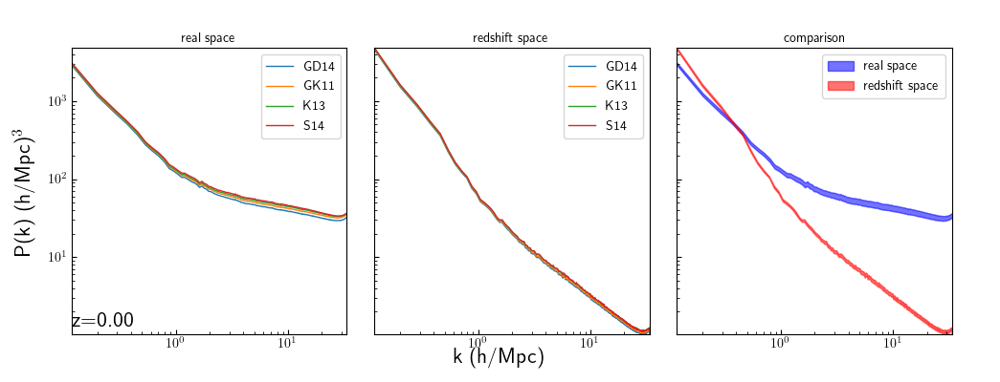
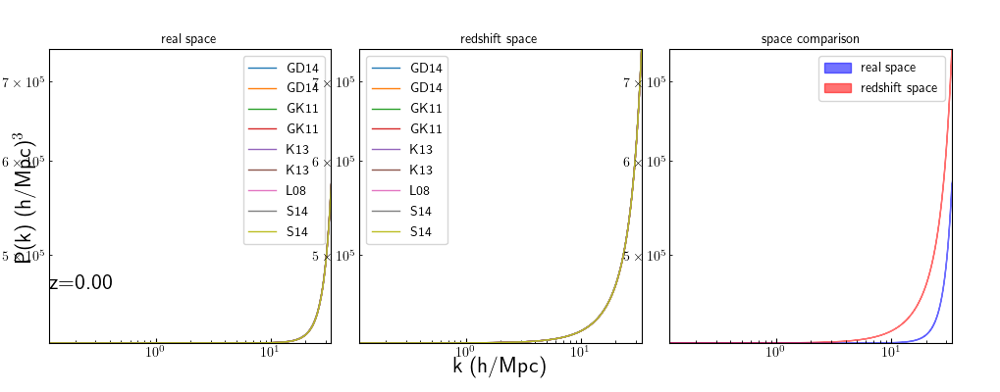
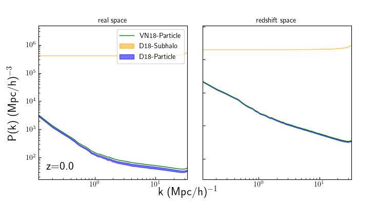

# Auto Power Spectrum for HI

This shows plots comparing various auto power spectra of the HI distributions used.Does so in real and redshift space, and calculates the redshift space distortions for each.

## To Do
* The nyquist frequency doesn't quite match up with where the shot noise occurs, shift the xlimit over a bit
* Investigate why there is a bump across VN18 and D18 at k~1.5 - idea is that they exhibit the same behavior even though they shouldn't necessarily "know" about each other.
* Calculate the strength of redshift-space distortions similar to Paco

# D18-Particle Auto Power

The good news is that this looks better than before! The separation between the models in redshift-space doesn't grow as compared to real-space, which is closer to what is expected. The bad news is that I don't know why; I'm doing the same operations (albeit in a different order) as last time, but getting different results. I'll look at my previous code and compare to my own to try to figure out why they look different.

## To Do
* Check old/new code for why the redshift-space would look different
* Give left and bottom border more room for text
* Remove redundant legend

# D18-Subhalo Auto Power

There's clearly a bug somewhere, the flat power spectrum indicates that the field is basically random. I'm unsure why this is the case, but still.

## To Do
* Find bug

# HI Auto Power Comparisons

VN18 and D18-Particle look fine, again some issue with D18-Subhalo.
## To Do
* 