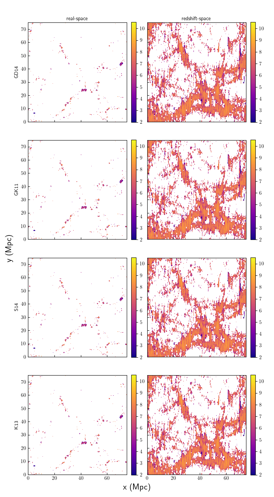
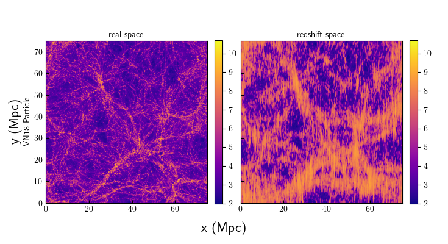
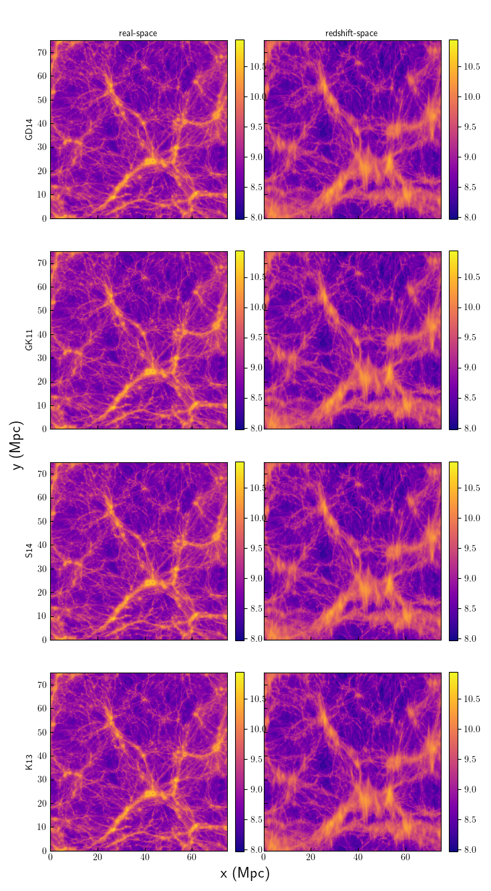

# Slices
Each of these plots show the matter distributions of the fields that are calculated using particle catalogs. The following plots show these at z=0 for TNG100-1. Slices of the volume, centered on the middle and encompassing 20% of the z-axis, are plotted in real-space and redshift-space. The line-of-sight for redshift-space distortions is along the y-axis. Colorbars are logarithmic in mass, specifically solar masses.

## To Do:
* Change to density in bin - it looks weird for the voids to have 10^2 solar masses of HI in the vn plots and I think it's more natural.
* Calculate what the expected extent of the fingers-of-god effect would be for particles, compare to these slices

# Comparing Particle Catalog Fields:

# Particle Slices

Here, each row corresponds to a different particle species. This looks as expected; dark matter and all matter covers all of the space and there are only stars in the densest regions and are very close together. The more dense regions are extended in redshift space due to more velocity dispersion.

## Further Investigation
This plot makes sense, might want to include just gas to maybe compare to the HI/H2 plots.

# D18-Particle HI Slices

Each row corresponds to a different molecular fraction model. Since the HI distribution is calculated for the particle cells that belong to a subhalo, but then assigned to bins according to the particle cell's position. With that in mind, the distribution makes sense, following the stellar mass distribution similarly. Comparing between models, there is no discernable difference between them, as expected since they don't result in significantly different cosmic HI abundances that would be noticeable by eye.

## Further Investigation
We could maybe find some better way to visualize/statistically test the differences between the models on a bin-by-bin basis, but I think Benedikt's paper already accomplishes this goal on a cell-by-cell basis and there isn't really any reason to expect that would change bin-by-bin.

# VN18-Particle HI Slices

Plots for Paco's HI distribution. I think it looks as expected. Looks somewhat similar to Paco's intensity maps, although those are mock-observed to have angular resolution effects, so they won't quite look the same.

# D18-Particle H2 Slices

This shows slices of TNG100-1 simulation at redshift 0, summing across 10% of the volume, comparing both real space and redshift space in each column. The colorbars are in logarithmic mass in solar masses. This one does *not* make sense; since this should just be the same cells as the HI slices but using the molecular fraction instead of (1-mol_frac).

## Further Investigation
I need to check whether both neutral fraction and molecular fraction are -1 in star-forming cells/cells that are not in a subhalo - I think that might be why it looks like where there isn't supposed to be any mass at all you actually have a significant amount of mass.