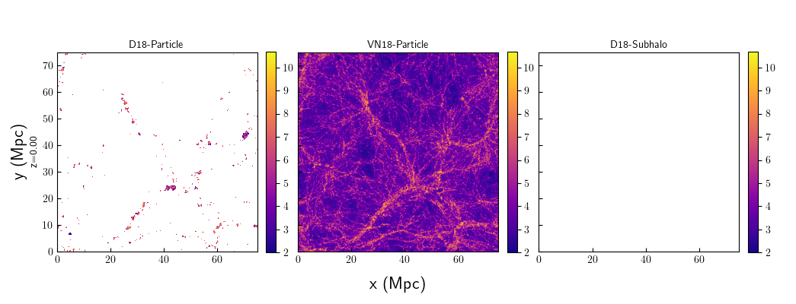

# Slices
Each of these plots show the matter distributions of the fields that are calculated using particle catalogs. The following plots show these at z=0 for TNG100-1. Slices of the volume, centered on the middle and encompassing 20% of the z-axis, are plotted in real-space and redshift-space. The line-of-sight for redshift-space distortions is along the y-axis. Colorbars are logarithmic in mass, specifically solar masses.

## To Do:
* Change to density in bin - it looks weird for the voids to have 10^2 solar masses of HI in the vn plots and I think it's more natural.
* Calculate what the expected extent of the fingers-of-god effect would be for particles, compare to these slices
* Increase the space between panels - colorbar tick labels extend into neighbor sometimes
* When the colorbars aren't the same magnitudes, make redshift vs real space comparisons use the same colorbar

# Comparing Particle Catalog Fields:

This plot compares all of the fields generated from the particle catalog. It selects just one model from Benedikt's results, since they all look very similar anyway. HI from both Paco and Benedikt have similar abundances in the massive halos. H2 looks very strange - it should look similar to HI in the sense it should be using only the particles that belong to subhalos, and there is way too much H2 in the voids. When calculating the HI distribution, I used HI mass = (1-f_mol) * f_neut * gas_mass and then mask out all of the masses that are below zero. I do the same with h2ptl, except replacing 1-f_mol with just f_mol; I think that the problem may be that if both the neutral fraction and molecular fraction are -1 then they cancel out, and I fail to mask out anything.

Otherwise, Paco's and the particle distribution makes sense, especially since HI should reside closer to the center of galaxies which is why the cosmic web looks thinner.

## To Do:
* Check h2ptl issue, if the molecular fraction and neutral fraction for cells that are supposed to be masked out.
* hiptl colobar's vmin vmax is too wide of a range, might be easier to differentiate within blobs

# Comparing HI Fields

These look mostly as expected. Since the D18-Subhalo run collapses all of the galaxy's mass to its center, they do not fill up a significant enough portion of the volume to be easily viewed. This could be solved by either decreasing the resolution of the grid (averaging neighboring grid points) or just using a scatter plot with points to blow up their locations a bit more.

## To Do
* Change hisubhalo slice procedure so its more easily viewable
* Add the model used to the title in D18 fields

# Particle Slices

Here, each row corresponds to a different particle species. This looks as expected; dark matter and all matter covers all of the space and there are only stars in the densest regions and are very close together. The more dense regions are extended in redshift space due to more velocity dispersion. There is more infalling matter, and that matter infalls faster.

## To Do
* Include gas to compare to HI/H2 (maybe neutral gas as well?)
* Stellar particles colorbar range is too wide, could differentiate a bit better by limiting the vmin.

# D18-Particle HI Slices

Each row corresponds to a different molecular fraction model. Since the HI distribution is calculated for the particle cells that belong to a subhalo, but then assigned to bins according to the particle cell's position. With that in mind, the distribution makes sense, following the stellar mass distribution similarly. Comparing between models, there is no discernable difference between them, as expected since they don't result in significantly different cosmic HI abundances that would be noticeable by eye.

## To Do
* We could maybe find some better way to visualize/statistically test the differences between the models on a bin-by-bin basis, but I think Benedikt's paper already accomplishes this goal on a cell-by-cell basis and there isn't really any reason to expect that would change bin-by-bin.

# VN18-Particle HI Slices

Plots for Paco's HI distribution. I think it looks as expected. Looks somewhat similar to Paco's intensity maps, although those are mock-observed to have angular resolution effects, so they won't quite look the same.

# D18-Particle H2 Slices

This one does *not* make sense; since this should just be the same cells as the HI slices but using the molecular fraction instead of (1-mol_frac). Within the redshift-space plot, I think that make sense - the redshift space distortions for H2 are significantly less than for HI. My interpretation is due to the fact that H2 exists closer to the center of galaxies so they shouldn't have significantly different velocities than the rest of the halo. I am curious though if maybe the RSD are getting smothered by my error - the voids have way, way more mass than they should, so the distorted matter would contribute significantly less. This would make the fingers-of-god effect less visible.

## To Do
* I need to check whether both neutral fraction and molecular fraction are -1 in star-forming cells/cells that are not in a subhalo - I think that might be why it looks like where there isn't supposed to be any mass at all you actually have a significant amount of mass.